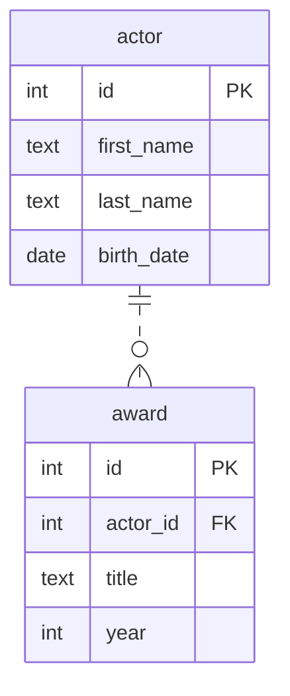

# Связь один ко многим

Даны 2 сущности:

- актер со свойствами имя, фамилия и дата рождения
- награда со свойствами название и год получения

У актера может быть много наград.\
Награда может принадлежать только одному актеру.

Данным сущностям соответствует следующая диаграмма:



Этой диаграмме в SQL соответствуют следующие таблицы и связи:

```sql
-- удаление таблиц, если они уже созданы
drop table if exists actors, awards cascade;

create table actors
(
    -- для обеспечения ссылочной целостности задается первичный ключ (уникальный идентификатор строки) в главной таблице
    -- и внешний ключ в зависимой таблице
    id         int primary key, -- первичный ключ
    first_name text,
    last_name  text,
    birth_date date
);

create table awards
(
    id       int primary key,
    actor_id int references actors, -- внешний ключ
    title    text,
    year     int
);


-- вставка данных
insert into actors(id, first_name, last_name, birth_date)
values (1, 'Том', 'Холланд', '1996-06-01'),
       (2, 'Бенедикт', 'Камбербэтч', '1976-07-19'),
       (3, 'Анастасия', 'Панина', '1983-01-15');

-- значения вставляемые в столбец actor_id должны присутствовать в главной таблице в столбце id
insert into awards(id, actor_id, title, year)
values (1, 1, 'Сатурн', 2022),
       (2, 1, 'Британская академия', 2017),
       (3, 2, 'Золотой глобус', 2022),
       (4, 2, 'Эмми', 2018),
       (5, 2, 'Оскар', 2015);

-- вывод данных из каждой таблицы по отдельности
select * from actors;

select * from awards;

-- вывод актеров и их наград (все столбцы из обеих таблиц)
select *
from actors
         left join awards on actors.id = awards.actor_id;

-- вывод только определенных столбцов
select first_name, last_name, title as award_title, year as award_year
from actors
    left join awards on actors.id = awards.actor_id;

-- вывод зависимой сущности в виде массива объектов
select
  ac.id,
  ac.first_name,
  ac.last_name,
  ac.birth_date,
  coalesce(json_agg(json_build_object(
    'id', aw.id, 'title', aw.title, 'year', aw.year))
      filter (where aw.id is not null), '[]')
        as awards
from actors ac
left join awards aw on ac.id = aw.actor_id
group by ac.id;
```
