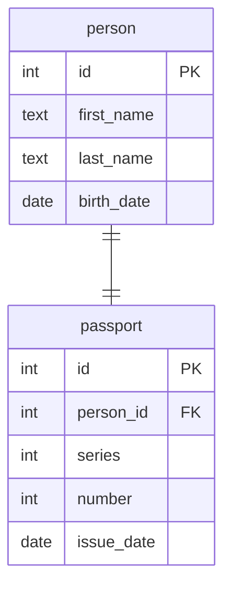

# Связь один к одному

Даны 2 сущности:

- человек со свойствами имя, фамилия и дата рождения
- паспорт со свойствами серия, номер и дата выдачи

У человека может быть один паспорт.\
Паспорт может принадлежать только одному актеру.

Данным сущностям соответствует следующая диаграмма:



Этой диаграмме в SQL соответствуют следующие таблицы и связи:

```sql
drop table if exists persons, passports cascade;

create table persons
(
    id         int primary key,
    first_name text,
    last_name  text,
    birth_date date
);

create table passports
(
    id         int primary key,
    person_id  int references persons unique, -- в связи one-to-one внешний ключ должен быть уникальным
    series     int,
    number     int,
    issue_date date
);

insert into persons(id, first_name, last_name, birth_date)
values (1, 'Том', 'Холланд', '1996-06-01'),
       (2, 'Бенедикт', 'Камбербэтч', '1976-07-19');

insert into passports(id, person_id, series, number, issue_date)
values (1, 1, 1234, 567890, '2010-12-31'),
       (2, 2, 4321, 987654, '2015-01-01');

select *
from persons
         left join passports on persons.id = passports.person_id;
```
