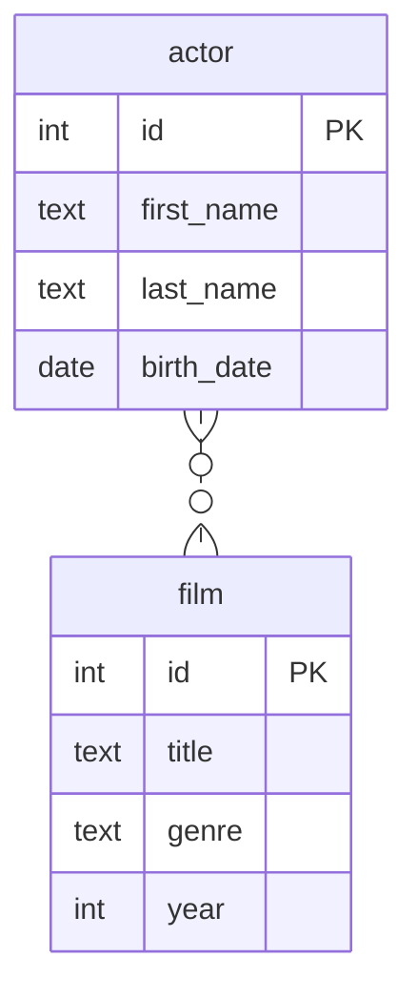

# Связь многие ко многим

Даны 2 сущности:

- актер со свойствами имя, фамилия и дата рождения
- фильм со свойствами название, жанр и год выпуска

Актер может сниматься в нескольких фильмах.\
В фильме может сниматься несколько актеров.

Данным сущностям соответствует следующая диаграмма:



Этой диаграмме в SQL соответствуют следующие таблицы и связи:

```sql
drop table if exists actors, films, film_to_actor cascade;

create table actors
(
    id         int primary key 
      generated by default as identity, -- автогенерация ключа
    first_name text,
    last_name  text,
    birth_date date
);

create table films
(
    id    int primary key generated by default as identity,
    title text,
    genre text,
    year  int
);

-- ассоциативная таблица для задания связи many-to-many
create table film_to_actor
(
    actor_id int references actors,
    film_id  int references films,
    primary key (actor_id, film_id)
);

insert into actors(first_name, last_name, birth_date)
values ('Tom', 'Hanks', '1956-07-09'),
       ('Robert', 'De Niro', '1943-08-17'),
       ('Al', 'Pacino', '1940-04-25');

insert into films(title, genre, year)
values ('Forrest Gump', 'Drama', 1994),
       ('The Godfather', 'Crime', 1972),
       ('The Godfather: Part II', 'Crime', 1974),
       ('The Irishman', 'Crime', 2019);

insert into film_to_actor(actor_id, film_id)
values (1, 1),
       (1, 4),
       (2, 2),
       (2, 3),
       (3, 2),
       (3, 3),
       (3, 4);


-- вывод актёров и их фильмов
select *
from actors a
         join film_to_actor fa on a.id = fa.actor_id
         join films f on fa.film_id = f.id;

select 
  f.id, 
  f.title, 
  f.genre, 
  f.year,
  coalesce(jsonb_agg(json_build_object(
    'id', a.id, 'first_name', a.first_name, 
    'last_name', a.last_name, 'birth_date', a.birth_date))
      filter (where a.id is not null), '[]') as actors
from films f
join actor_to_film af on f.id = af.film_id
join actors a on a.id = af.actor_id
group by f.id;

-- вывод фильмов и их актёров
select 
  a.id,
  a.first_name,
  a.last_name,
  a.birth_date,
  coalesce(jsonb_agg(jsonb_build_object(
    'id', f.id, 'title', f.title, 'genre', f.genre))
      filter (where a.id is not null), '[]') as films
from actors a
join actor_to_film af on a.id = af.actor_id 
join films f on f.id = af.film_id
group by a.id;
```
