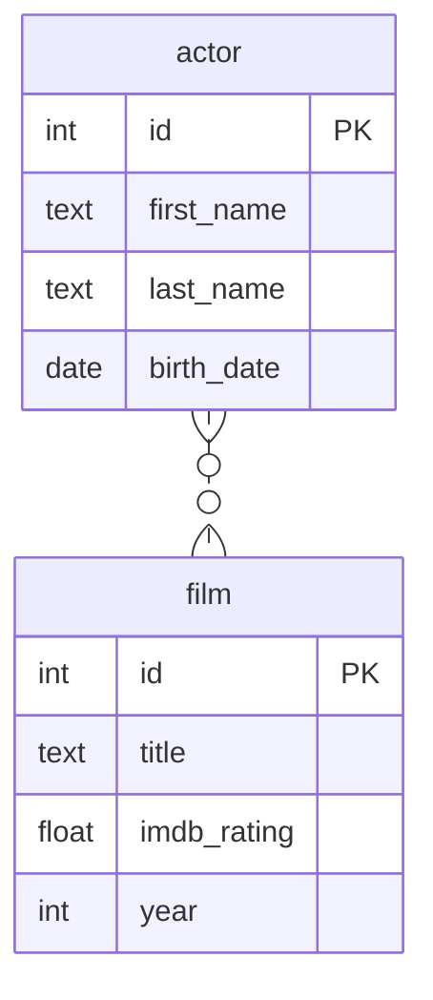

# Связь многие ко многим

Даны 2 сущности:

- актер со свойствами имя, фамилия и дата рождения
- фильм со свойствами название, imdb рейтинг и год выпуска

Актер может сниматься в нескольких фильмах.\
В фильме может сниматься несколько актеров.

Данным сущностям соответствует следующая диаграмма:



Этой диаграмме в SQL соответствуют следующие таблицы и связи:

```sql
drop table if exists actors, films, film_to_actor cascade;

create table actors
(
    id         int primary key
        generated by default as identity, -- автогенерация ключа
    first_name text,
    last_name  text,
    birth_date date
);

create table films
(
    id          int primary key generated by default as identity,
    title       text,
    imdb_rating float,
    year        int
);

-- ассоциативная таблица для задания связи many-to-many
create table film_to_actor
(
    actor_id int references actors,
    film_id  int references films,
    primary key (actor_id, film_id)
);

insert into actors(first_name, last_name, birth_date)
values ('Том', 'Холланд', '1996-06-01'),
       ('Бенедикт', 'Камбербэтч', '1976-07-19'),
       ('Марк', 'Руффало', '1956-11-22'),
       ('Крис', 'Хемсворт', '1983-08-11'),
       ('Анастасия', 'Панина', '1983-01-15');

insert into films(title, imdb_rating, year)
values ('Человек-паук: Нет пути домой', 8.2, 2021),
       ('Мстители: Финал', 8.4, 2019),
       ('Тор: Рагнарёк', 7.9, 2017),
       ('Койяанискаци', 8.2, 1982);

insert into film_to_actor(actor_id, film_id)
values (1, 1),
       (1, 2),
       (2, 1),
       (2, 2),
       (3, 2),
       (3, 3),
       (4, 2),
       (4, 3);

-- вывод актёров и их фильмов в табличном представлении
select *
from actors a
         join film_to_actor fa on a.id = fa.actor_id
         join films f on fa.film_id = f.id;

-- вывод актёров и их фильмов в виде массива объектов
select
  a.id,
  a.first_name,
  a.last_name,
  a.birth_date,
  coalesce(jsonb_agg(jsonb_build_object(
    'id', f.id, 'title', f.title, 'imdb_rating', f.imdb_rating))
      filter (where f.id is not null), '[]') as films
from actors a
left join film_to_actor af on a.id = af.actor_id
left join films f on f.id = af.film_id
group by a.id;

-- вывод фильмов и их актёров в виде массива объектов
select
  f.id,
  f.title,
  f.imdb_rating,
  f.year,
  coalesce(json_agg(json_build_object(
    'id', a.id, 'first_name', a.first_name,
    'last_name', a.last_name, 'birth_date', a.birth_date))
      filter (where a.id is not null), '[]') as actors
from films f
left join film_to_actor af on f.id = af.film_id
left join actors a on a.id = af.actor_id
group by f.id;
```
